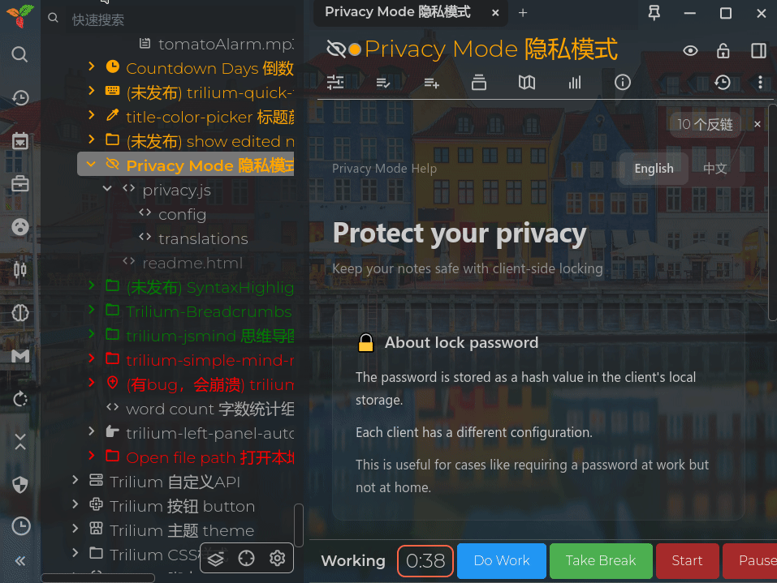
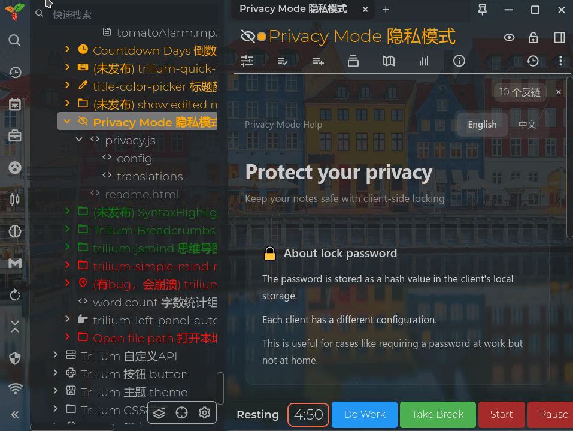
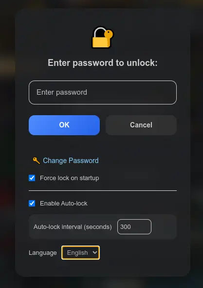

# 👁️‍🗨️ Privacy Mode Widget :)

[中文说明](README_CN.md)

Please stand up and stretch your body for a while if you see this :)

Protect your notes from prying eyes :)

**✨ Keep your notes a little more private**

A privacy mode widget for Trilium Notes

- One-click blur of the note tree and other areas while editing, so you can focus on writing.
- Lock all areas so everything is blurred and unselectable.
- Auto-lock notes in case you forget to lock manually when you leave.

# ✨ What it does

## 👁️ Blur mode

Just click the eye button on the note title bar.

It blurs titles, the note tree, tabs and similar elements, and also hides the browser tab title. Click again to turn it off. Useful when you need to focus on editing.

## 🔒 Lock mode

Click the lock button to lock. Once locked, the editor becomes read-only and blurred.

Notes can no longer be edited or copied. It covers more than blur alone — the note area, internal link hover tooltips, and more are also hidden.

Supports force lock on startup, so others can't just open Trilium from the desktop and see all your notes.

## ⏱️ Auto lock

Supports auto-lock: if you don't interact with Trilium for a while, it locks itself.

Default is 5 minutes. You can change the timeout freely in the unlock dialog.

## 🌐 Multi-language support

Supports English and Simplified Chinese.

You can switch language in the unlock dialog. Your choice is remembered.

# 📥 How to install

1. Download the zip file from the [release page](https://github.com/Nriver/privacy-mode/releases).
2. Right-click the note tree in Trilium and click Import, then uncheck "Safe Import".
3. Restart Trilium Notes, or use `ctrl+r` to reload the interface.
4. Open any note — you should see the eye and lock buttons on the right side of the title bar.
5. Have fun.

# 💡 Hints

1. The privacy mode password is independent from your Trilium password. You can set a simple, easy-to-type password just for privacy mode.
2. Options like auto-lock and force lock on startup live in the unlock dialog — tweak them to fit your needs.
3. If you want to clear the password, read the note inside the plugin

# 🤔 Why I made this?

I don't like other people casually browsing through my notes.

Trilium does have "protected notes", but that feature leans toward encryption. Trilium itself has no one-click quick lock — anyone walking by your computer can see all your notes. If you forget to lock your computer, anyone who opens Trilium from the desktop can read everything. So I made this plugin: when someone comes over, quickly blur the note tree and titles so they can't tell at a glance what you're working on. When you leave your seat, lock it with a password so others can't read your notes. And in case you forget to lock, it can also auto-lock after a period of inactivity — play around with that in the settings.

Another issue with Trilium's protected notes is that they use the same password as your login. With this privacy mode plugin, you can set a simple independent password that doesn't have to match your Trilium master password.

One more thing: privacy mode settings live only on the current client. That means you can use a password unlock at work, and skip the password unlock on your home computer.

Anyway, hope this is useful for you too :)

# 💖 Donation

Hello! If you like my work, please consider supporting me. Your support is greatly appreciated. Thank you!

Alipay:  

Wechat Pay:  

Support me on Ko-fi:  

